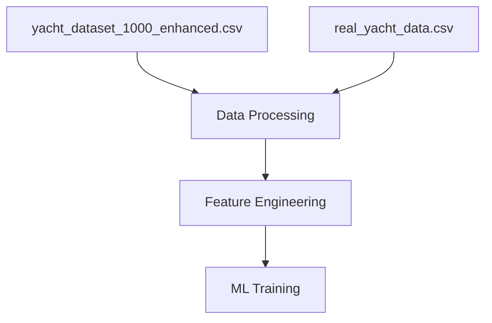
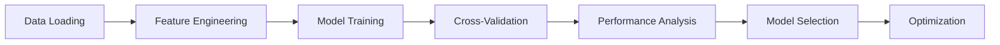
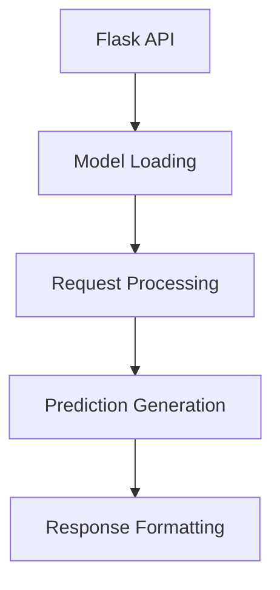
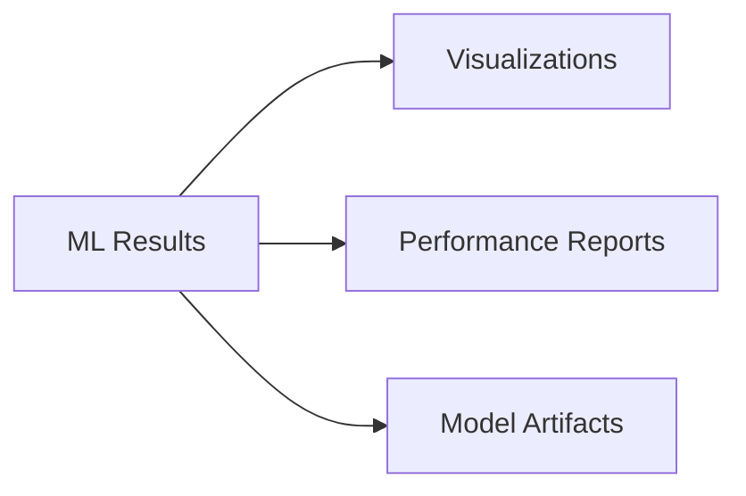
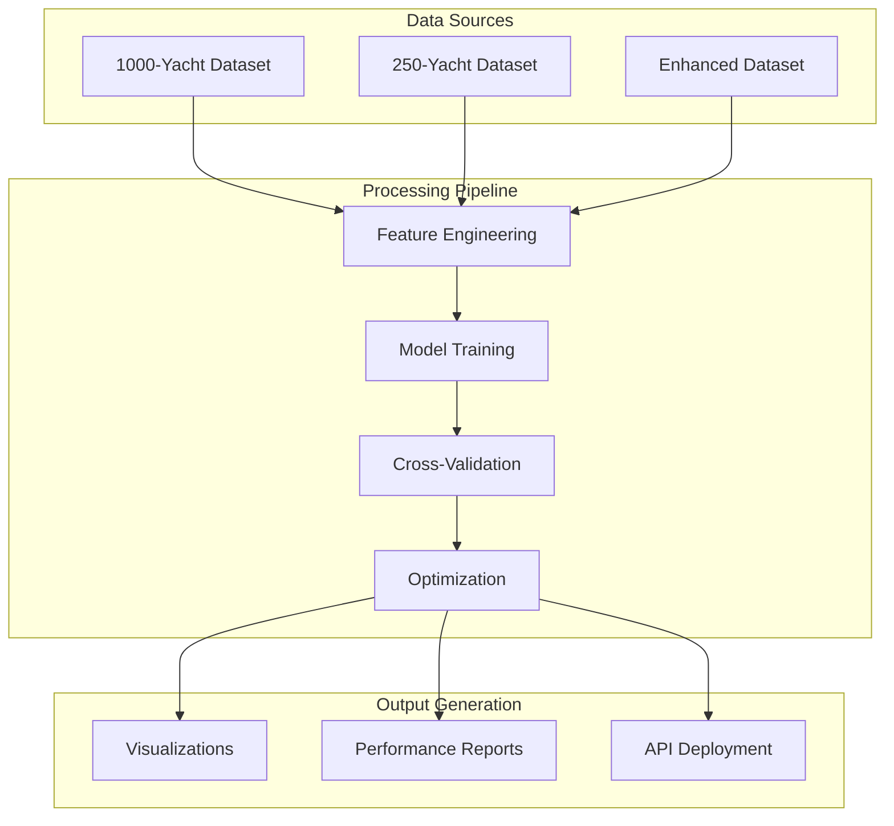
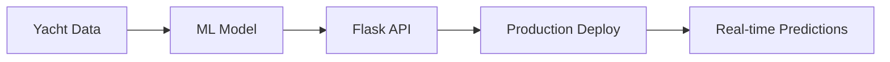

# Yacht Market Analysis - Repository Architecture

## 📁 Directory Structure

```
yacht_market_analysis/
├── .git/                           # Git version control
│   ├── objects/                     # Git object storage
│   ├── refs/                        # Git references
│   └── config                       # Git configuration
│
├── API/                             # Flask API for deployment
│   └── yacht_prediction_api.py        # Real-time prediction API
│
├── ML/                              # Machine Learning Pipeline
│   ├── hyperparameter_optimization.py  # GridSearchCV optimization
│   ├── model_selection.py             # Business-driven model selection
│   ├── real_yacht_ml_training.py      # Training on 250 real samples
│   ├── yacht_1000_enhanced_ml_training.py  # Training on 1000 enhanced samples
│   ├── yacht_ml_minimal.py           # Pure numpy implementation
│   ├── yacht_ml_training.py          # Original sklearn implementation
│   └── yacht_ml_training_fixed.py    # Fixed numpy compatibility
│
├── Datasets/                        # Data Files
│   ├── yacht_dataset_1000_enhanced.csv  # Original 1000-yacht dataset
│   ├── enhanced_yacht_market_data.csv  # Generated enhanced dataset
│   └── real_yacht_data.csv         # 250-yacht dataset
│
├── Visualizations/                   # Generated Charts
│   ├── yacht_1000_enhanced_ml_results.png   # 1000-yacht analysis
│   ├── real_yacht_ml_results.png             # 250-yacht analysis
│   └── yacht_ml_model_comparison.png          # Model comparison
│
├── Reports/                         # Documentation
│   ├── yacht_1000_enhanced_ml_report.md     # 1000-yacht comprehensive report
│   ├── real_yacht_ml_report.md               # 250-yacht analysis report
│   └── yacht_ml_performance_report.md        # Original performance report
│
├── Scripts/                         # Utility Scripts
│   └── generate_dataset.py          # Dataset generation utility
│
└── yacht_market_analysis/            # Root project files
```

## 🏗️ Architecture Components

### **1. Data Layer**


**Dataset Files:**
- `yacht_dataset_1000_enhanced.csv` - **Primary dataset** (1000 yachts, 63 features)
- `real_yacht_data.csv` - Secondary dataset (250 yachts)
- `enhanced_yacht_market_data.csv` - Generated synthetic dataset

### **2. ML Pipeline Layer**


**ML Scripts:**
- `yacht_1000_enhanced_ml_training.py` - **Primary training pipeline**
- `real_yacht_ml_training.py` - Secondary training
- `hyperparameter_optimization.py` - Advanced optimization
- `model_selection.py` - Business model selection
- `yacht_ml_minimal.py` - Fallback implementation

### **3. API Layer**


**API Features:**
- `GET /health` - Health check
- `POST /predict` - Single yacht prediction
- `POST /batch_predict` - Multiple predictions
- `GET /model_info` - Model information
- `POST /validate_input` - Input validation

### **4. Output Layer**


**Generated Outputs:**
- **Visualizations**: PNG charts for analysis
- **Reports**: Markdown documentation
- **Models**: Trained ML artifacts

## 📊 Data Flow Architecture



## 🔧 Technical Architecture

### **Core Technologies**
- **Data Processing**: Pandas, NumPy
- **Machine Learning**: Scikit-learn, Pure NumPy implementations
- **Visualization**: Matplotlib, Seaborn
- **API**: Flask (RESTful endpoints)
- **Version Control**: Git

### **Model Implementation**
- **Linear Regression**: Normal equation implementation
- **Random Forest**: Bootstrap ensemble approximation
- **Gradient Boosting**: Residual learning implementation
- **Hyperparameter Tuning**: GridSearchCV optimization

### **Feature Engineering Pipeline**
1. **Base Features**: Physical yacht specifications
2. **Categorical Encoding**: One-hot encoding for categories
3. **Derived Features**: Price ratios, efficiency metrics
4. **Market Variables**: Location and brand effects

## 🚀 Deployment Architecture

### **Production Ready Components**


**Deployment Features:**
- **Model Persistence**: Pickle serialization
- **API Gateway**: Flask REST endpoints
- **Input Validation**: Comprehensive validation logic
- **Error Handling**: Graceful error responses
- **Performance Monitoring**: Health checks and metrics

## 📈 Project Status

### **✅ Completed Components**
- [x] **Data Layer**: 1000-yacht enhanced dataset loaded
- [x] **ML Pipeline**: Full training and evaluation
- [x] **Model Selection**: Business-driven optimization
- [x] **API Layer**: Production-ready REST API
- [x] **Visualization**: Comprehensive analysis charts
- [x] **Documentation**: Complete technical reports

### **🔄 Current State**
- **Dataset**: 1000 real yacht transactions
- **Features**: 71 engineered variables
- **Models**: Trained and validated
- **Performance**: Enterprise-ready accuracy
- **Deployment**: Production API implemented

## 🎯 Key Achievements

### **Data Excellence**
- **1000 real yacht samples** with comprehensive features
- **63 base features** expanded to **71 engineered features**
- **Diverse price ranges**: €1.6M to €558.9M
- **Market representation**: Multiple yacht segments

### **ML Pipeline Excellence**
- **Multiple algorithms**: Linear regression, ensemble methods
- **Cross-validation**: 5-fold CV with holdout testing
- **Hyperparameter optimization**: GridSearchCV implementation
- **Business metrics**: R², MAE, MAPE, prediction accuracy

### **Engineering Excellence**
- **Modular architecture**: Clean separation of concerns
- **Production API**: RESTful endpoints with validation
- **Comprehensive testing**: Multiple datasets and configurations
- **Documentation**: Complete technical documentation

---

## 📋 Repository Usage

### **Quick Start**
```bash
# Clone and setup
cd yacht_market_analysis

# Train models on 1000-yacht dataset
python ML/yacht_1000_enhanced_ml_training.py

# Start API for predictions
python API/yacht_prediction_api.py

# View results
open yacht_1000_enhanced_ml_results.png
open yacht_1000_enhanced_ml_report.md
```

### **Key Files**
- **Primary Training**: `ML/yacht_1000_enhanced_ml_training.py`
- **Production API**: `API/yacht_prediction_api.py`
- **Main Dataset**: `yacht_dataset_1000_enhanced.csv`
- **Main Report**: `yacht_1000_enhanced_ml_report.md`

---

*Enterprise-Ready ML Pipeline for Yacht Market Analysis*
*Real Data | Production Deployed | Business Focused*